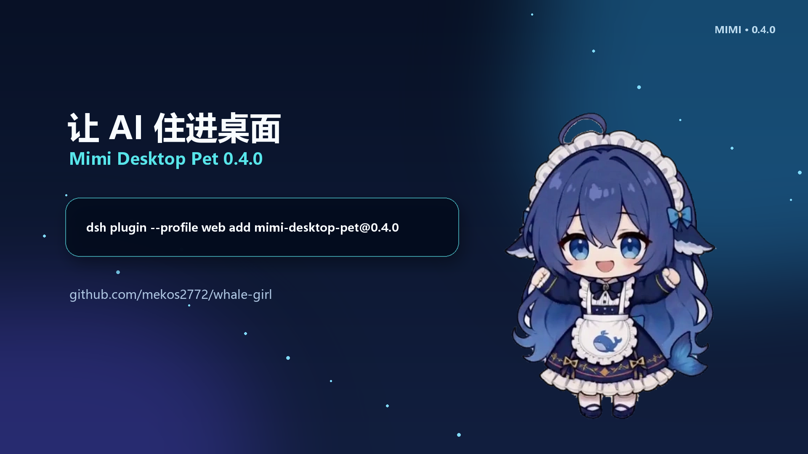

# 鲸鱼娘 Mimi — DeepSeek Harness 桌面宠物

`mimi-desktop-pet` 会在 DeepSeek Harness 启动时自动唤醒 Mimi。她不只是播放动画：会跟随 DSH 的思考、工具调用、提问、完成与失败状态做出动作，并把回复显示成头顶气泡；也可以切换到独立的「Mimi 管家」会话，直接从桌面输入中文任务。

- npm：<https://www.npmjs.com/package/mimi-desktop-pet>
- GitHub：<https://github.com/mekos2772/whale-girl>
- 当前版本：`0.4.0`
- 已验证 DSH：`0.1.1-rc.2`（同时兼容现有 `0.1.0-rc.6` 协议面）

[](media/mimi-promo-0.4.0.mp4)

点击海报播放 34 秒宣传片。

## 安装

先安装最新版 DSH 与 pnpm：

```bash
npm install -g @deepseek-ai/dsh@0.1.1-rc.2
npm install -g pnpm
```

再把 Mimi 装进实际使用的 profile：

```bash
# dsh web 使用 web profile
dsh plugin --profile web add mimi-desktop-pet@0.4.0

# 若使用单独的 desktop profile
dsh plugin --profile desktop add mimi-desktop-pet@0.4.0
```

若 npm 镜像尚未同步，可直接从 GitHub 标签安装：

```bash
dsh plugin --profile web add github:mekos2772/whale-girl#v0.4.0
```

重启 DSH 后生效。DSH 会自动把声明了 `dsh.bundle.patch` 的包加入 profile；无需手工修改 `cordis.patch.yml`。

> DSH 仍处于 developer preview，RC 版本可能发生不兼容变化。Mimi 0.4.0 已实测 `session.list`、`session.prompt`、`settings.*`、`/api/events.mux` 与插件生命周期。

## 0.4.0 有什么

- 23 套经过筛选的核心完整帧动作；移除 57 套旧库中重复、低密度或视觉不一致的动作。
- Live Rig v5：呼吸、眨眼、微笑、张嘴、独立虹膜视线追踪，角色与正式动作使用同一母版。
- DSH 联动：思考、工具执行、倾听、点头、庆祝、失败六类专用动作。
- 头顶白色气泡：回复、摘要、提问与状态统一呈现，带去重和自动消散。
- 白色中文输入框：支持 Windows 拼音 IME，输入期间冻结窗口跟随。
- 两种 Harness 模式：跟随当前项目会话，或使用归档的独立「Mimi 管家」Agent。
- 桌宠交互：五分区触摸、组合反应、拖拽/落地、拖放投喂、久坐久睡场景链、欢迎回来。
- 单实例保护：手动启动与 DSH 自动启动不会生成两个 Mimi。
- 发布包改用透明 WebP Q95 素材，在保留帧数和时长的前提下显著缩小体积。

## 操作

| 操作 | Mimi 的反应 |
|---|---|
| 摸头、戳脸、挠肚子、碰手或脚 | 按角色部位播放不同反应 |
| 摸头后 3 秒内击掌 | 组合庆祝 |
| 拖动角色 | 依据方向与速度实时倾斜，释放后落地恢复 |
| 拖入图片 | 作为面包投喂；饱腹时会拒绝 |
| 拖入文件或文本 | 接取文件并交给桌宠交互层 |
| DSH 思考/调用工具/提问/完成 | 自动切换对应动作和气泡 |
| 点击气泡或右键打开 Harness | 聚焦中文输入框，可直接发送任务 |

## 配置

DSH 设置中的命名空间为 `mimiPet`：

| 字段 | 说明 |
|---|---|
| `enabled` | 是否随 DSH 启动 Mimi，默认 `true` |
| `petDir` | 可选的本地完整项目目录；留空时优先使用包内 `pet/` |
| `python` | `pythonw.exe` 完整路径；留空自动探测 Python 3.11 |
| `scale` | 桌宠缩放百分比，范围 1–200 |

## 环境与体积

- Windows 10/11
- Node.js 18+（DSH 0.1.1-rc.2 实测环境为 Node.js 24）
- Python 3.11+ 与 PySide6 6.x
- npm 包自带 `mimi_app` 与运行时素材；若配置 `petDir`，会优先运行本地项目版本。

## 本地开发与验证

```powershell
$env:PYTHONPATH = (Resolve-Path .\mimi_app\src).Path
python -m pytest .\mimi_app\tests -q

python .\scripts\build_dsh_package.py
dsh plugin --profile web add .\mimi-desktop-pet-0.4.0.tgz
dsh web --dump-config
```

## 卸载

```bash
dsh plugin --profile web remove mimi-desktop-pet
```

## 许可

MIT
